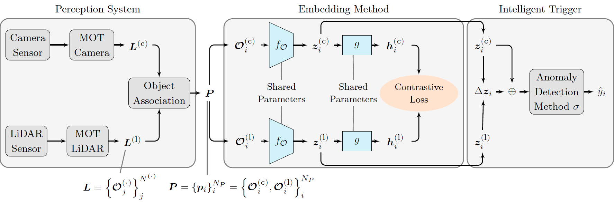

<p align="center">
  <h1 align="center"><strong>Monitoring Automotive Perception Sensors <br> Using Latent Representations
    </strong></h1>
    <p align="center">
</p>
<p align="center">
  <a href="https://www.degruyterbrill.com/journal/key/auto/html?lang=de&srsltid=AfmBOoryLU36PlSlWbFSlwW6IDd8UMF4yvD5IKOsxLS_-VJJs7VT7SIP">
    
  </a>
  
</p>

  <p align="center">
    <h3 align="center">
      <a href="https://www.linkedin.com/in/alexanderfertig/" >Alexander Fertig</a><sup>1</sup> and    
      <a href="https://www.thi.de/personen/prof-dr-ing-michael-botsch/">Michael Botsch</a><sup>1,2</sup>&nbsp;&nbsp;
    </h3>    
    <p align="center">
    <small><sup>1</sup>Technische Hochschule Ingolstadt, AImotion Bavaria, Esplanade 10, 85049 Ingolstadt, Germany,</small>
    <br>
    <small><sup>2</sup>Technische Hochschule Ingolstadt, Research Center CARISSMA , Esplanade 10, 85049 Ingolstadt, Germany,</small>
    <br>
    <a href="mailto:alexander.fertig@thi.de">alexander.fertig@thi.de</a> and <a href="mailto:michael.botsch@thi.de">michael.botsch@thi.de</a>
    <br>    
  </p>
  </p>
</p>


<br>
<br>

## Overview

This repository provides the official implementation of the journal article:

**"Monitoring Automotive Perception Sensors Using Latent Representations"**

Paper Link: to be announced


> **Abstract:** Safeguarding autonomous vehicles is a constant challenge, since unknown circumstances that the system may not be able to handle can always arise in real-world traffic. This work proposes a monitoring framework for automotive perception sensors to detect such situations. The objective is to detect anomalous behavior from LiDAR and camera sensors at the level of object state estimations. A contrastive embedding method is used to map object states into a structured latent space. An intelligent trigger utilizes this representation space to perform anomaly detection. A key feature of the monitoring framework is that no anomaly labels are required during the training. Further, the proposed monitoring framework can be applied online, complying with ISO 21448 regarding operation phase activities. Experiments are performed on the publicly available real-world nuScenes dataset.


<br>
<br>

## Architecture Overview

Architecture overview. The proposed monitoring framework contains three main components: the perception system, the embedding method and the intelligent trigger.

<td align="center">
  <br>
</td>


<br>
<br>

## Setup

#### Requirements
The code was developed using the following environment:
- Python 3.9.21
- Torch 2.5.1
- CUDA 12.6 (optional, required for GPU acceleration)

Other versions may work but have not been explicitly tested.


### Installation
1. Clone this repository
2. Create an environment and install dependencies:
```bash
pip install -r requirements.txt
```

3. Download the processed database from [Data-Link](https://faubox.rrze.uni-erlangen.de/getlink/fi9gfqY6RxAjNMtKFBwZN3/) and unzip it into the `\data`, resulting in:
```bash
data/nuscenes/train/base/
data/nuscenes/test/base/
data/nuscenes/val/base/

```
Each sample corresponds to one nuScenes scene, which contains the object lists from different sensor modalities. 


### Development environment
This code was developed and tested on a platform with Windows 11, using CUDA 12.6 on an NVIDIA RTX 5000 Ada Generation.


<br>
<br>

## Code Usage

These commands initiate the training process and save the resulting models and logs.

### Model Training
To train the contrastive learning framework and evaluate the online monitoring framework:
```bash
python main.py
```
During training, the object encoder learns to generate latent representations for each input object, thereby structuring the latent embedding space.
During evaluation, these learned object embeddings are used to fit and apply the anomaly detection components.


## Citation
```
@article{Fertig2026,
  title   = {Monitoring Automotive Perception Sensors Using Latent Representations},
  author  = {Alexander Fertig and Michael Botsch},
  year    = {2026},
  journal = {TBD},
  pages   = {TBD},
  doi     = {TBD},
}
```

